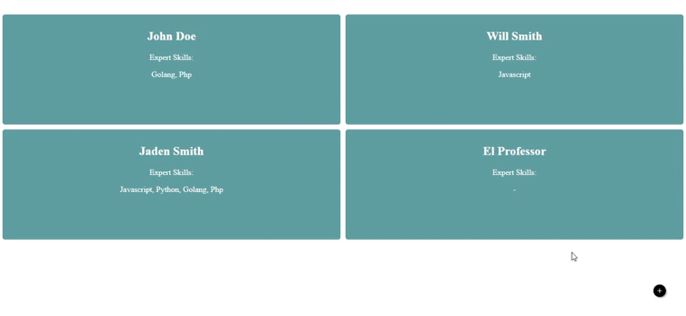

# Qlue Frontend Intern Test

## Author

Almeiza Arvin Muzaki

## 1. Deskripsi Aplikasi

-   Aplikasi dideploy pada `https://frontend-test-qlue.netlify.app/`

## 2. Instalasi dan Pemakaian

Untuk instalasi lokal,

-   Clone project ini  
    `git clone https://github.com/almeizaarvin/frontend-technical-test`
     
-   Install package yang diperlukan dengan `npm install`
     
-   Jalankan program dengan command `npm run start`

### 2.2 Cara Pemakaian
- Klik pada nama person untuk melihat detail profil
- Klik tombol '+' untuk menambahkan profil

## 3. Screenshot

